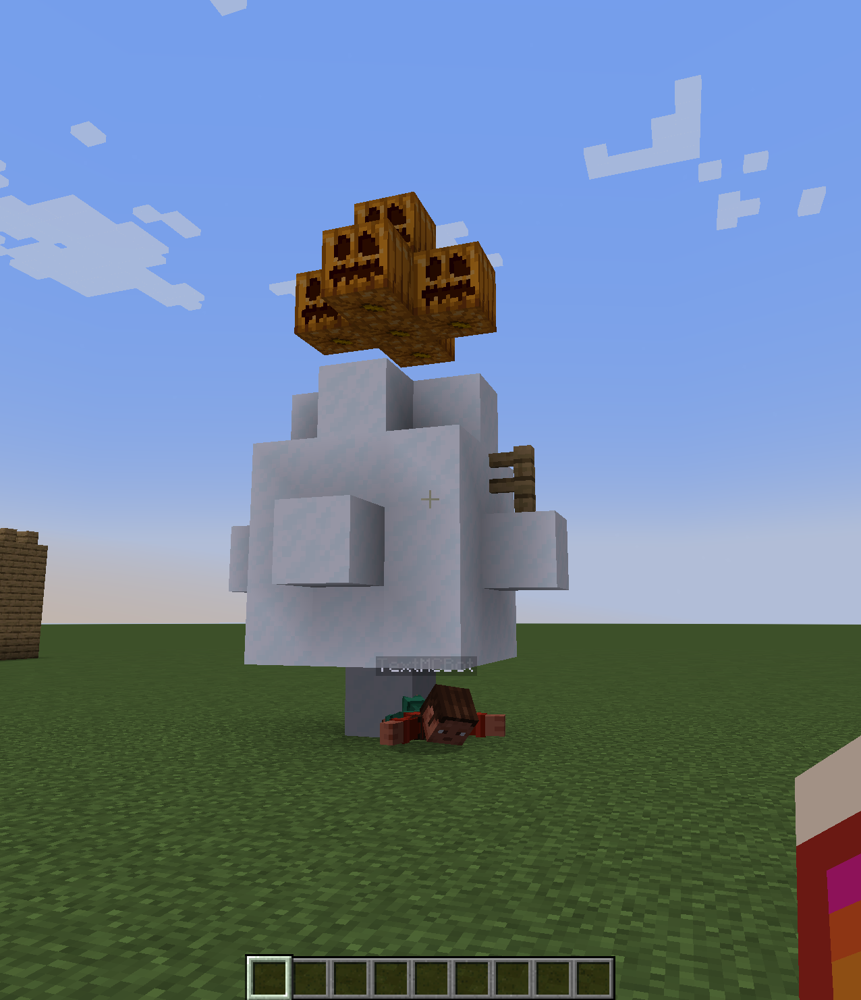

# Text-To-Minecraft
>
> A bot to help you with all your Minecraft-related needs!

TextToMinecraft is a bot that can perform all kinds of Minecraft-related tasks, and it can even build structures for you! All you need to do is chat with the bot in-game like you would with ChatGPT or other LLMs, and it will perform what you describe to the best of its ability.

> ### WARNING:
> 
> This project is still very much a work-in-progress, so use with caution if you plan on testing it in a Minecraft world.
<!--


## Installation

OS X & Linux:

```sh
npm install my-crazy-module --save
```

Windows:

```sh
edit autoexec.bat
```
-->
## Usage example

### "build a snowman"

**Result:**\


## Setup

0. Own Minecraft (and an OpenAI key). This also means you need to be on Windows.
1. Clone the repository on your machine.
2. Create a Python virtual environment in the project directory, and be sure to activate it so nothing gets installed globally.
3. Run ``pip install .`` to install all the dependencies from ``pyproject.toml``.
4. Substitute your OpenAI API key in ``.env.sample`` and rename that file to ``.env``.
5. \[OPTIONAL] Download the example JSON schematics zip file from [here](https://drive.google.com/drive/folders/1q03E-f1bOjCPomgHZ7Lgc39NZP9RZczs?usp=sharing) and extract it into the /data directory. This is currently optional because this data is not used in the present version.
6. Start coding! Be aware of the pricing for OpenAI API access when you run the program.

## Connecting the bot to your world

The bot works by connecting to a LAN world hosted on your machine. The process is outlined here:

1. Run the program with ``python main.py`` and you should see a controller window asking for the server port.
2. Launch Minecraft 1.20.4 and open a world.
3. In the pause menu, click **Open to LAN**. In the following menu, set the gamemode to **Creative** and Allow Cheats to **On**. Open the LAN server.
4. You should see a port show up in the chat. Copy this port and paste it in the controller window's port field.
5. Click the connect button and the bot should join your world and say hello!
6. Once you're done interacting with it, use the "\$exit" command to disconnect the bot, then close the controller window.
<!--
## Release History

* 0.2.1
  * CHANGE: Update docs (module code remains unchanged)
* 0.2.0
  * CHANGE: Remove `setDefaultXYZ()`
  * ADD: Add `init()`
* 0.1.1
  * FIX: Crash when calling `baz()` (Thanks @GenerousContributorName!)
* 0.1.0
  * The first proper release
  * CHANGE: Rename `foo()` to `bar()`
* 0.0.1
  * Work in progress
-->
## Meta

Ryan Hardy – <ryyhardy@gmail.com>

[https://github.com/ryyHardy/text-to-minecraft](https://github.com/ryyHardy/text-to-minecraft)

## Contributing

1. Fork it (<https://github.com/ryyHardy/text-to-minecraft/fork>)
2. Create your feature branch (`git checkout -b feature/fooBar`)
3. Commit your changes (`git commit -am 'Add some fooBar'`)
4. Push to the branch (`git push origin feature/fooBar`)
5. Create a new Pull Request
