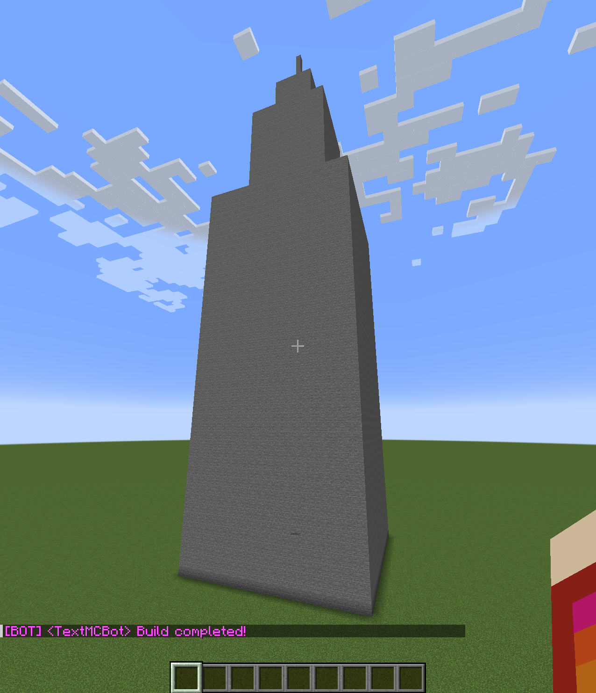

# Text-To-Minecraft

> A bot that builds with you in your Minecraft world!

TextToMinecraft is a bot that uses AI to build structures for you in-game based on your prompt! It is also equipped with other features like some basic pathfinding and the ability to interact with in-game
commands.

Powered by [mineflayer](https://github.com/PrismarineJS/mineflayer) and the rest of the [Prismarine.js](https://github.com/prismarinejs) project.

> ### WARNING
>
> This project is still very much a work-in-progress, so use with caution if you plan on testing it in a Minecraft world. The bot can build some really cool things, but it could destroy preexisting landscapes and buildings in the process.

<!--


## Installation

OS X & Linux:

```sh
npm install my-crazy-module --save
```

Windows:

```sh
edit autoexec.bat
```
-->

## Usage example

### `TextMCBot: build "the Empire State Building"`

**Result:**\


## Setup (Dev)

0. Own Minecraft Java Edition (check [mineflayer](https://github.com/PrismarineJS/mineflayer) for supported versions). Bedrock Edition is not supported yet. You will also need an OpenAI API key.
1. Clone the repository on your machine, and open a command line in that directory.
2. Substitute your OpenAI key in `.env.sample` and rename that file to `.env`.
3. Run `npm install` to install dependencies.
4. Run `npm start` and this will open the desktop app.

## Connecting the bot to your world

The bot works by connecting to a LAN world. The process to set this up is outlined here:

1. Have the Text-to-Minecraft desktop app opened.
2. Have a Minecraft world open (again, check [mineflayer](https://github.com/PrismarineJS/mineflayer) for supported versions).
3. Pause Minecraft and click `Open to LAN`. In the menu that appears, choose `Gamemode: Creative` and `Allow Cheats: On` (the bot needs cheats to function). Take note of the port number for later. You can set your own value for it if you want.
4. In the desktop app, put the port you saved from the previous step in the port field. Leave the host field as `localhost`.
5. Click connect. The bot will spawn in your world and say hello!

> NOTE: If someone else is hosting the LAN world on your network instead, you must know their IPV4 (for the host field) and server port (for the port field) to connect the bot. The world would also need the same permission settings for gamemode and cheats. **Connecting the bot to an "online" or "public" server does not work due to authentication. It would probably get kicked or banned anyway.**

## Interacting with the bot

Players can issue commands to the bot through Minecraft's chat window by pressing T (by default). Commands are given in the format `<bot-username>: <command>`. To see the list of commands for a bot named `TextMCBot`, for example, you would send `TextMCBot: helpme` in the chat. Here are some of the commands you can use:

- `helpme` will show a list of available commands, their arguments, and descriptions.
- `build "<prompt>"` is the bot's primary feature. It takes in a prompt and builds a structure for it at the bot's location.
- `come` will have the bot pathfind to your location. It could take a while over longer distances. It is very entertaining to watch, though.
- `where` will have the bot tell you where it is in the world, and in what dimension.
- `exit` will have the bot disconnect from the server. The controller window will stay open in case you want to reconnect it.

## TODOs

- The program could use a better logging system for both the controller window and command line output. Ideally, you could keep track of what a bot is generally doing without even checking Minecraft itself.
- Improving the organization of bot-related code, especially in `bot.ts`.
- Adding more bot configuration in the UI, including a "whitelist" for players allowed to command the bot.
- Eventually finding a way to have multiple bots (that would be fun).
- Finding a way to handle LLM API keys safely. Right now, it just loads the keys from a .env file, which is not ideal in a release.
- The bot has little to no awareness of its surroundings which is dangerous on more populated worlds.
- Potentially making a version of the bot that is more friendly for survival mode.
- Make a release!

<!--
## Release History

* 0.2.1
  * CHANGE: Update docs (module code remains unchanged)
* 0.2.0
  * CHANGE: Remove `setDefaultXYZ()`
  * ADD: Add `init()`
* 0.1.1
  * FIX: Crash when calling `baz()` (Thanks @GenerousContributorName!)
* 0.1.0
  * The first proper release
  * CHANGE: Rename `foo()` to `bar()`
* 0.0.1
  * Work in progress
-->

## Meta

Ryan Hardy – <ryyhardy@gmail.com>

[https://github.com/ryyHardy/text-to-minecraft](https://github.com/ryyHardy/text-to-minecraft)

## Contributing

1. Fork it (<https://github.com/ryyHardy/text-to-minecraft/fork>)
2. Create your feature branch (`git checkout -b feature/fooBar`)
3. Commit your changes (`git commit -am 'Add some fooBar'`)
4. Push to the branch (`git push origin feature/fooBar`)
5. Create a new Pull Request
